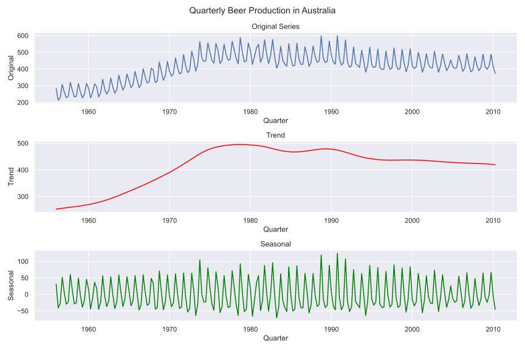
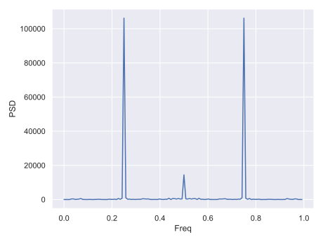

# Time Series Seasonal-Trend Decomposition (in C++)

This repository contains code that performs Seasonal-Trend Decomposition on a time series, using the Hodrick-Prescott Filter and the Radix-2 Fast Fourier Transformation. I wrote these from scratch in C++ as an exercise. The implementations are contained within the folder `fft_hpfilter`, along with the executable (when compiled) that performs the time series decomposition.

The python scripts (to be written) will visualize the output of the C++ code.

## The Data

`aus_production.csv` is taken from the `tsibbledata` package in R. It comprises of quarterly estimates of select indicators of manufacturing production in Australia, ranging from Q1 of 1956 to Q2 of 2010. 

## Methods

### Hodrick-Prescott Filter (HP Filter)

The Hodrick-Prescott Filter is a method to smooth a time series, in order to try and decompose the trend and seasonal components. If $x_t$ is the original time series and $\theta_t$ is the desired, smoothed trend component, then the HP filter minimizes the following function:

$$
\sum_{t=1}^n (x_t - \theta_t)^2 + \lambda \sum_{t=2}^{n-1}\left((\theta_{t+1} - \theta_t)- (\theta_t - \theta_{t-1})\right)^2
$$

$\theta_t$ ultimately has a closed form, which can be computed by solving a symmetric banded linear system; I originally wrote the solution by hand, before opting for LAPACKE and its built-in solver for positive-definite, banded, symmetric systems: `LAPACKE_dpbsv`. After $\theta_t$ is found, we subtract $\theta_t$ from $x_t$, and the residual $\delta_t = x_t - \theta_t$ may be treated as the seasonal component.

For decomposing a time series, the HP Filter is disadvantaged by the fact that it assumes that the season-trend model is additive; if the effects are multiplicative, the HP Filter is not an appropriate tool. In `aus_production`, I chose to mainly examine Beer production, as it was the series that seemed to most closely follow an additive season-trend model. 

One advantage that the HP Filter has is its similarity to Gaussian Kernel Smoothing. But while that method involves a full matrix inversion, which is expensive and prone to numerical instability, the HP Filter being a positive-definite, banded, and symetric system means that the computation is only $O(n)$.

### Cooley-Tukey Fast-Fourier Transform (FFT)

The Fast-Fourier Transform is one of the most important computational algorithms made in the 20th century. To preface, the Discrete Fourier Transform (DFT) maps a sequence of numbers (presumed to come from some temporal process with periodicity) to a complex-valued frequency representation. The DFT is given by

$$
    X_k = \sum_{t=0}^{n-1} x_t e^{-i 2\pi \frac{kt}{n}}
$$

the DFT is a crucial method in signal processing and for the Power Spectral Density, which can help identify periodicities in some process. As written, the DFT has a time complexity of $O(n^2)$. The FFT, first made by J.W. Cooley and John Tukey, exploits a recursive relation in the DFT that reduces time complexity to $O(n\log n)$. 

My implementation of the FFT is the most basic one: the Radix-2 FFT, taking a sequence of size $N$ such that $N$ is a positive power of 2.

## Running The Code

Before running any code, do install the libraries as listed in `environment.yml`. I used `mamba` through miniforge, so it is probably best to use the same environment manager. Note that `liblapacke` does require the "developer" version, as the default installation does not provide the headers needed for compiling the C++ code.

### The C++ Code

Navigate to `fft_hpfilter`. If you have set up the environment correctly, simply activate your environment and type `make` in the terminal to compile the file. `make clean` will remove the compiled file.

Then, running `./seasonal_decompose` will run the code

### Python Visualizations

Navigate back to the main directory (`cd ..`). Then, you can simply type in `python visualization.py` to produce visualizations of the decomposition and of the spectral analysis.

## Visual Results

### Season-Trend Decomposition

### Spectral Analysis

